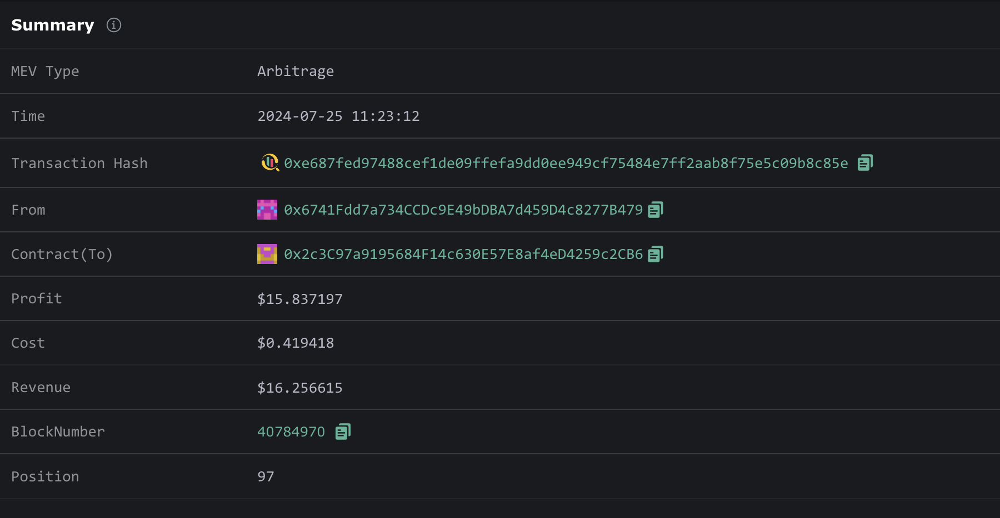

# MEV Arbitrage Detector

# Usage

```shell
pip install moralis 
./mev_arb_detector.py
```

## Design Overview
1. Download all the historical transactions' receipts in a local directory. So we don't have to constantly calling the APIs during development and testing.
2. For each block, read through all the corresponding transaction receipts(with focus on transfer and swap events), determine if there is arbitrage in each transaction. If there is, record the token contract address and the arbitraged amount, save it for later.
3. Using Moralis API, we are able to fetch the token price at a given block time on a given chain.
4. We calculate the total revenue of a tx as: *total revenue of a tx* =  sum(arb_token1_price * arb_token2_amonut). 
5. The total cost of a tx can be computed as total cost of a tx = gas_used * gas_price * bnb_price(In the block where the tx is at).
6. The total profit of a tx = total revenue of a tx - total cost of a tx.

## Implemenation Details and workflow

1. `./TxReceiptGenerator.py`  first fetches a list of `tx_hash` in each block by calling `eth_getBlockByNumber` method in `https://docs-demo.bsc.quiknode.pro/`
2. Given a list of `tx_hash` for each block, we then call ` eth_getTransactionReceipt` to get `tx_recipt` for each `tx_hash` . In additon, we are also calling `eth_getTransactionByHash` to get the `value` field and `gasPrice` field. we then dump these data into a json file under `/tx_recipts` for our main parser to read. Note that here we have to limit our request to the API endpoint around 5 times/s due to quiknode's rate limiter.
3. Running the program by `./mev_arb_detector.py` .
   1.  In `dispatch_block(start_block, end_block)`, for each block, it loads the `tx_receipts.json` file first to parse the relevant `tx_receipts` info, then we are calling `process_tx(tx_hash, tid, receipt)` for each transaction.
   2. In `process_tx(tx_hash, tid, receipt)`, we loop through the event logs for each transaction and aiming for `transfer` and `swap` based on `topics[0]` for each log.
   3. We maintain a `balances` dict {address => {token_address: token_amount}}. for each `transfer` event encountered, we update this `balances` dict. and we also build a graph incrementally based on `transfer`. For each `swap` event we encountered, we add the address for the `swap` itself into a set. In addition, we also add the swapped addresses for each swap into a set. 
   4. After processing all the event logs, if there's a positive balance for any token in `balances`, there might be an abitrage for this transaction. But we still need to go throuh a series of checks to filter it.
   5. If a transaction is an arbitrage transaction, we keep track of `gas_used` and `gas_price` in this transaction and returns ` [tid, tx_hash, arb_tokens, gas_used, gas_price]`.
   6. In order to determine the usd_price for each arbitraged token, we need to use an external API, I chose moralis because it gives the usd_price for any ERC20 token on BSC at any given block. In order to minimize the amount of calls the program makes to query the API, we keep track of the arbitrage information for each transaction till the end of processing every block. Thus, we only need to call the API once at the end of processing each block(the price wouldn't change within a block). Finally, In `process_pnl(arb_res_block, block)` we fetch the usd_price for each token from the returned dictionary and compute the revenue, cost and profit for each arbitrage transaction.

## Testing, Proof of Correctness and Some Analysis

In order to test correctness for the occurences of arbitrage transactions. I used EigenPhi as a reference, Under `/tests`, for each block I manually created a `*_ref` file that contains the referenced arbitrage transaction id in each block. When running  `./mev_arb_detector.py` , it writes `_res` file which contains abitrage transaction id  into `/tests` directory. You can run `./CheckResult.sh` to compare the differneces between the result my program produced and the result I gathered from EigenPhi.

```
 ✘ ianchen@Ians-MBP ~/mev_arb_detector.py ./CheckResult.sh
File Comparison Script
=====================
Comparing arbitrages found in block 40784970: tests/40784970_res and tests/40784970_ref
----------------------------------------
The files are different. Here's the diff:
2,3d1
< 118
< 128
----------------------------------------

Comparing arbitrages found in block 40784971: tests/40784971_res and tests/40784971_ref
----------------------------------------
The files are different. Here's the diff:
1d0
< 96
----------------------------------------

Comparing arbitrages found in block 40784972: tests/40784972_res and tests/40784972_ref
----------------------------------------
The files are identical
OK!
----------------------------------------

Comparing arbitrages found in block 40784973: tests/40784973_res and tests/40784973_ref
----------------------------------------
The files are identical
OK!
----------------------------------------

Comparing arbitrages found in block 40784974: tests/40784974_res and tests/40784974_ref
----------------------------------------
The files are identical
OK!
----------------------------------------

Comparing arbitrages found in block 40784975: tests/40784975_res and tests/40784975_ref
----------------------------------------
The files are identical
OK!
----------------------------------------

Comparing arbitrages found in block 40784976: tests/40784976_res and tests/40784976_ref
----------------------------------------
The files are identical
OK!
----------------------------------------

Comparing arbitrages found in block 40784977: tests/40784977_res and tests/40784977_ref
----------------------------------------
The files are identical
OK!
----------------------------------------

Comparing arbitrages found in block 40784978: tests/40784978_res and tests/40784978_ref
----------------------------------------
The files are identical
OK!
----------------------------------------

Comparing arbitrages found in block 40784979: tests/40784979_res and tests/40784979_ref
----------------------------------------
The files are identical
OK!
----------------------------------------

Comparing arbitrages found in block 40784980: tests/40784980_res and tests/40784980_ref
----------------------------------------
The files are identical
OK!
----------------------------------------

All comparisons completed.
```


Here I listed all 3 differences between the results my program produced and the results listed on EigenPhi web UI.  I investigated each of these differences. I think there could be bugs in the EigenPhi website that identifying arbitrage trades or I am missing something. Please share your thoughts I'm curious :)

- Differences:

  - Block 40784970

    - [Tx118](https://eigenphi.io/mev/eigentx/0x89c0f2c0184541e9cba8a8ec7811e7caa1f56e7a25e3b1cc411f8003762ebf3c): EigenTx didn't mark this one as arbitrage but I think it should be. contract address `0x7bba2A9A00a8b5D3BE3f86F5c6140Bf6E5F79A1` didn't receive funding from EOA before the transaction events. It completes a series of swapping(pancakeV2 <=> pancakeV2 <=> pancakeV3) and ended up with +0.021489 WBNB on its balance. At the end, it transfered +0.021489 WBNB into to an EOA leaf node address (`0xC0CA1BDE7339a71709878acb4477B1D072EACF00`). This tx should be an arbitrage tx with +0.021489 WBNB in my opinion.
    - [Tx128](https://eigenphi.io/mev/eigentx/0x1d71c57641c6902bbf2cc6b5e890f7c4b1d681926d26dddeee64654cd4190e78) Same as above.

  - Block 40784971

    - [Tx96](https://eigenphi.io/mev/eigentx/0x424b57560fe4ae639f9e21c293a21af72443a39cb08a618e7816ba08485bbb41): EigenTx didn't mark this one as arbitrage but I think it should be. This is a interesting one where the arbitraged account is not tx_to contract address in the transaction. Instead it's an EOA. We can clearly see `0xDc5497014D5BBE0f0c8b54F049f1682DC9beed46` ended up with +0.007080 USDT in its balance after the swapping. However, what confuses me is where does the address `0xDc5497014D5BBE0f0c8b54F049f1682DC9beed46` come from? Because this addres is neither `From` nor `To` of the transaction. My guess is `0xDc5497014D5BBE0f0c8b54F049f1682DC9beed46` might be hardcoded in the [contract](0x48e29Cc270a9421CA95F373786F3b15B812370f6) where this tx is interacting with. So the workflow of this tx might be the [sending party](0xa3EB1AcC8CE4Cd8fa5BAB8787570d944b82387FD) invoked `0x22a3d2bd` method on the [contract](0x48e29Cc270a9421CA95F373786F3b15B812370f6). But instead of the contract starts arbitrage process on its own, it called another hardcoded address(0xDc5497014D5BBE0f0c8b54F049f1682DC9beed46) and started the arbitrage loop. I could be completely wrong here but that's my hypothesis.

      

  Now, Let's check the correctness of revenue and profit for each arbitrage transaction. Because the fiat price source I'm using comes from moralis API so there might be small difference between the fiat price source EigenPhi is using, so I'm checking the correctness by manually comparing. 

  - Here's an example output of running `./mev_arb_detector.py` 

    ```bash
     ianchen@Ians-MBP ./mev_arb_detector.py
    /Users/ianchen/Library/Python/3.9/lib/python/site-packages/urllib3/__init__.py:35: NotOpenSSLWarning: urllib3 v2 only supports OpenSSL 1.1.1+, currently the 'ssl' module is compiled with 'LibreSSL 2.8.3'. See: https://github.com/urllib3/urllib3/issues/3020
      warnings.warn(
    CRITICAL:root:Arbs found in block: 40784970
    CRITICAL:root:Tx 97: WBNB: $16.248284060582773 with total cost $0.41920280769710144 Profit: $15.829081252885672
    CRITICAL:root:Tx 118: WBNB: $12.151857892924292 with total cost $0.5043055581840193 Profit: $11.647552334740274
    CRITICAL:root:Tx 128: WBNB: $1.0045388929009058 with total cost $0.3978830113218304 Profit: $0.6066558815790755
    CRITICAL:root:Arbs found in block: 40784971
    CRITICAL:root:Tx 96: USDT: $0.007083651890661113 with total cost $0.0009360106070462905 Profit: $0.006147641283614823
    CRITICAL:root:Tx 97: WBNB: $0.0015322024639385348 with total cost $0.0004518267055184446 Profit: $0.0010803757584200901
    CRITICAL:root:Tx 106: BTCB: $0.0019246203429761674 with total cost $9.643616786078419e-05 Profit: $0.0018281841751153832
    CRITICAL:root:Tx 111: USDT: $0.00010501002182982273 with total cost $4.128838673390798e-05 Profit: $6.372163509591475e-05
    CRITICAL:root:Tx 116: USDT: $5.055928005084933e-05 with total cost $2.0221576538832956e-05 Profit: $3.033770351201637e-05
    CRITICAL:root:Tx 117: USDT: $5.31682069864686e-05 with total cost $2.128966721448755e-05 Profit: $3.187853977198105e-05
    CRITICAL:root:Tx 118: USDT: $3.88120748657221e-05 with total cost $1.3149652297713415e-05 Profit: $2.5662422568008687e-05
    CRITICAL:root:Tx 119: USDT: $3.81271737594993e-05 with total cost $1.5259465897005024e-05 Profit: $2.2867707862494274e-05
    CRITICAL:root:Tx 120: WBNB: $3.378412900478531e-05 with total cost $1.3259815382993976e-05 Profit: $2.0524313621791333e-05
    CRITICAL:root:Tx 125: BUSD: $6.441884427681764e-05 with total cost $1.8457488985437688e-09 Profit: $6.44169985279191e-05
    CRITICAL:root:Tx 147: BUSD: $1.3735279656515835e-05 with total cost $8.392267354123272e-11 Profit: $1.3735195733842295e-05
    CRITICAL:root:Tx 166: ETH: $8.183117005097306e-05 with total cost $0.0 Profit: $8.183117005097306e-05
    CRITICAL:root:Tx 168: WBNB: $0.0005160002165925417 with total cost $0.0 Profit: $0.0005160002165925417
    CRITICAL:root:Tx 169: WBNB: $7.192850662063628e-05 with total cost $0.0 Profit: $7.192850662063628e-05
    CRITICAL:root:Tx 171: WBNB: $0.0003308883359236014 with total cost $0.0 Profit: $0.0003308883359236014
    CRITICAL:root:Tx 172: WBNB: $0.00017692816470305756 with total cost $0.0 Profit: $0.00017692816470305756
    CRITICAL:root:Tx 173: WBNB: $0.00014614829005865914 with total cost $0.0 Profit: $0.00014614829005865914
    CRITICAL:root:Tx 174: ETH: $0.0005384019790694543 with total cost $0.0 Profit: $0.0005384019790694543
    CRITICAL:root:Tx 175: BUSD: $0.0001294727981784994 with total cost $0.0 Profit: $0.0001294727981784994
    CRITICAL:root:Tx 176: WBNB: $6.564353545037436e-05 with total cost $0.0 Profit: $6.564353545037436e-05
    CRITICAL:root:Tx 177: USDT: $0.0006662664177150756 with total cost $0.0 Profit: $0.0006662664177150756
    CRITICAL:root:Tx 179: WBNB: $3.753406479318865e-05 with total cost $0.0 Profit: $3.753406479318865e-05
    CRITICAL:root:Tx 180: WBNB: $4.3807134260080344e-05 with total cost $0.0 Profit: $4.3807134260080344e-05
    CRITICAL:root:Tx 181: BUSD: $2.005826981636453e-05 with total cost $0.0 Profit: $2.005826981636453e-05
    CRITICAL:root:Tx 184: WBNB: $0.0004464076027452425 with total cost $0.0 Profit: $0.0004464076027452425
    CRITICAL:root:Tx 185: WBNB: $5.147280624941197e-05 with total cost $0.0 Profit: $5.147280624941197e-05
    CRITICAL:root:Tx 186: BUSD: $7.582224552200978e-05 with total cost $0.0 Profit: $7.582224552200978e-05
    CRITICAL:root:Tx 187: WBNB: $7.246393095368453e-07 with total cost $0.0 Profit: $7.246393095368453e-07
    CRITICAL:root:Tx 190: WBNB: $8.631445913876339e-05 with total cost $0.0 Profit: $8.631445913876339e-05
    CRITICAL:root:Tx 191: WBNB: $1.2000067073337132e-06 with total cost $0.0 Profit: $1.2000067073337132e-06
    CRITICAL:root:Tx 207: USDT: $0.0002276210092791917 with total cost $0.0 Profit: $0.0002276210092791917
    CRITICAL:root:Tx 208: ETH: $0.00015541704193730552 with total cost $0.0 Profit: $0.00015541704193730552
    CRITICAL:root:Tx 209: WBNB: $5.611332785568708e-05 with total cost $0.0 Profit: $5.611332785568708e-05
    CRITICAL:root:Tx 218: WBNB: $0.001127475498983169 with total cost $0.0 Profit: $0.001127475498983169
    CRITICAL:root:Tx 220: WBNB: $5.2297468475717425e-05 with total cost $0.0 Profit: $5.2297468475717425e-05
    CRITICAL:root:Tx 229: WBNB: $1.1123058633290026e-05 with total cost $0.0 Profit: $1.1123058633290026e-05
    CRITICAL:root:Tx 230: WBNB: $8.670508812610052e-05 with total cost $0.0 Profit: $8.670508812610052e-05
    CRITICAL:root:Tx 231: ETH: $0.01556628293071399 with total cost $0.0 Profit: $0.01556628293071399
    CRITICAL:root:Tx 238: USDT: $0.0008670240388604013 with total cost $0.0 Profit: $0.0008670240388604013
    CRITICAL:root:Tx 239: ETH: $0.0007038456881347272 with total cost $0.0 Profit: $0.0007038456881347272
    CRITICAL:root:Tx 241: ETH: $0.018137142741362 with total cost $0.0 Profit: $0.018137142741362
    CRITICAL:root:Tx 242: ETH: $0.0012699245159363565 with total cost $0.0 Profit: $0.0012699245159363565
    CRITICAL:root:Tx 244: USDC: $0.006271855732450805 with total cost $0.0 Profit: $0.006271855732450805
    CRITICAL:root:Tx 245: WBNB: $0.00017945314503000392 with total cost $0.0 Profit: $0.00017945314503000392
    CRITICAL:root:Tx 247: ETH: $0.0006346946983890993 with total cost $0.0 Profit: $0.0006346946983890993
    CRITICAL:root:Tx 252: USDT: $0.00012151753359105034 with total cost $0.0 Profit: $0.00012151753359105034
    CRITICAL:root:Tx 256: USDT: $0.0002490476151459548 with total cost $0.0 Profit: $0.0002490476151459548
    CRITICAL:root:Arbs found in block: 40784972
    CRITICAL:root:Tx 36: ETH: $3.1604793073448675e-15WBNB: $1.1586670044341523 with total cost $0.140010711587579 Profit: $1.0186562928465763
    CRITICAL:root:Tx 110: USDT: $6.745251751046653e-05 with total cost $0.00015003425802681683 Profit: $-8.25817405163503e-05
    CRITICAL:root:Tx 113: BTCB: $0.0019216551973641745 with total cost $9.757806527672419e-05 Profit: $0.0018240771320874503
    CRITICAL:root:Tx 115: USDT: $0.00010518070412766014 with total cost $4.2020609100326404e-05 Profit: $6.316009502733374e-05
    CRITICAL:root:Tx 116: USDT: $0.00010347657220355766 with total cost $3.692672929396405e-05 Profit: $6.654984290959361e-05
    CRITICAL:root:Tx 125: USDT: $0.00011607356297161634 with total cost $2.0981136013075175e-10 Profit: $0.00011607335316025622
    CRITICAL:root:Tx 134: WBNB: $0.001573646321605197 with total cost $0.0 Profit: $0.001573646321605197
    CRITICAL:root:Tx 136: USDT: $0.00019050621954633593 with total cost $0.0 Profit: $0.00019050621954633593
    CRITICAL:root:Tx 140: ETH: $0.0010885097431704814 with total cost $0.0 Profit: $0.0010885097431704814
    CRITICAL:root:Tx 141: ETH: $0.0003581540196831747 with total cost $0.0 Profit: $0.0003581540196831747
    CRITICAL:root:Tx 142: USDT: $0.00015657480165410864 with total cost $0.0 Profit: $0.00015657480165410864
    CRITICAL:root:Tx 144: ETH: $0.0003151921441341751 with total cost $0.0 Profit: $0.0003151921441341751
    CRITICAL:root:Tx 145: USDT: $0.0001020897106996647 with total cost $0.0 Profit: $0.0001020897106996647
    CRITICAL:root:Tx 148: USDT: $7.350561362492871e-05 with total cost $0.0 Profit: $7.350561362492871e-05
    CRITICAL:root:Tx 151: ETH: $8.800718607901213e-05 with total cost $0.0 Profit: $8.800718607901213e-05
    CRITICAL:root:Tx 152: USDT: $1.1146191138383481e-05 with total cost $0.0 Profit: $1.1146191138383481e-05
    CRITICAL:root:Tx 154: USDT: $1.2517765642043445e-07 with total cost $0.0 Profit: $1.2517765642043445e-07
    CRITICAL:root:Tx 156: USDT: $6.4213977428066995e-06 with total cost $0.0 Profit: $6.4213977428066995e-06
    CRITICAL:root:Tx 157: USDT: $9.399213517296254e-06 with total cost $0.0 Profit: $9.399213517296254e-06
    CRITICAL:root:Tx 159: USDT: $5.128414050955419e-06 with total cost $0.0 Profit: $5.128414050955419e-06
    CRITICAL:root:Tx 161: USDT: $1.5880253524864565e-07 with total cost $0.0 Profit: $1.5880253524864565e-07
    CRITICAL:root:Tx 162: USDT: $4.986841723067803e-05 with total cost $0.0 Profit: $4.986841723067803e-05
    CRITICAL:root:Tx 165: USDT: $0.000913536792753927 with total cost $0.0 Profit: $0.000913536792753927
    CRITICAL:root:Arbs found in block: 40784973
    CRITICAL:root:Arbs found in block: 40784974
    CRITICAL:root:Arbs found in block: 40784975
    CRITICAL:root:Arbs found in block: 40784976
    CRITICAL:root:Arbs found in block: 40784977
    CRITICAL:root:Tx 120: USDT: $0.01794347061506069 with total cost $0.0025357800573981904 Profit: $0.0154076905576625
    CRITICAL:root:Tx 126: WBNB: $0.0015459853986890322 with total cost $0.00015904916754557345 Profit: $0.0013869362311434588
    CRITICAL:root:Tx 127: USDT: $0.0004243168969746153 with total cost $0.00012981783764718678 Profit: $0.00029449905932742854
    CRITICAL:root:Tx 128: WBNB: $0.0007083705819190054 with total cost $0.00010019463081835619 Profit: $0.0006081759511006493
    CRITICAL:root:Tx 133: BUSD: $5.631224297073924e-05 with total cost $2.251818293610751e-05 Profit: $3.379406003463173e-05
    CRITICAL:root:Tx 136: USDT: $5.274178287745622e-05 with total cost $1.627703489024885e-05 Profit: $3.6464747987207364e-05
    CRITICAL:root:Tx 146: WBNB: $7.172675468375738e-05 with total cost $1.847550648803206e-09 Profit: $7.172490713310857e-05
    CRITICAL:root:Tx 147: ETH: $0.000862439421231811 with total cost $2.9241389797605637e-10 Profit: $0.000862439128817913
    CRITICAL:root:Tx 149: USDT: $0.012503033154975023 with total cost $1.5729677906512855e-10 Profit: $0.012503032997678243
    CRITICAL:root:Tx 151: USDT: $0.011220064561976122 with total cost $1.6000434657362665e-10 Profit: $0.011220064401971775
    CRITICAL:root:Tx 153: USDT: $0.04666558052217152 with total cost $2.2383462854715071e-10 Profit: $0.04666558029833689
    CRITICAL:root:Tx 156: WBNB: $0.010138883346321285 with total cost $2.0937617281254757e-10 Profit: $0.010138883136945113
    CRITICAL:root:Tx 161: USDT: $0.015825613040733898 with total cost $1.584277596451194e-10 Profit: $0.015825612882306137
    CRITICAL:root:Tx 167: USDT: $8.455315232055637e-05 with total cost $8.913088303820955e-11 Profit: $8.455306318967333e-05
    CRITICAL:root:Tx 171: WBNB: $9.04586316195072e-08 with total cost $0.0 Profit: $9.04586316195072e-08
    CRITICAL:root:Tx 177: USDC: $0.0003548166916896441 with total cost $0.0 Profit: $0.0003548166916896441
    CRITICAL:root:Tx 179: WBNB: $0.0005768201474821667 with total cost $0.0 Profit: $0.0005768201474821667
    CRITICAL:root:Tx 180: ETH: $3.3271907982321404e-05 with total cost $0.0 Profit: $3.3271907982321404e-05
    CRITICAL:root:Tx 182: WBNB: $0.000145548429401842 with total cost $0.0 Profit: $0.000145548429401842
    CRITICAL:root:Tx 184: WBNB: $7.307706151699996e-06 with total cost $0.0 Profit: $7.307706151699996e-06
    CRITICAL:root:Tx 185: BUSD: $6.95401398618739e-05 with total cost $0.0 Profit: $6.95401398618739e-05
    CRITICAL:root:Tx 186: WBNB: $2.7950962632209867e-05 with total cost $0.0 Profit: $2.7950962632209867e-05
    CRITICAL:root:Tx 187: USDT: $0.0001469898281392193 with total cost $0.0 Profit: $0.0001469898281392193
    CRITICAL:root:Tx 188: WBNB: $1.0795678387878827e-06 with total cost $0.0 Profit: $1.0795678387878827e-06
    CRITICAL:root:Tx 189: WBNB: $2.7807983450337517e-05 with total cost $0.0 Profit: $2.7807983450337517e-05
    CRITICAL:root:Tx 190: WBNB: $3.4685077895838885e-05 with total cost $0.0 Profit: $3.4685077895838885e-05
    CRITICAL:root:Tx 195: ETH: $0.00012032278360956277 with total cost $0.0 Profit: $0.00012032278360956277
    CRITICAL:root:Tx 196: WBNB: $5.593568805218864e-06 with total cost $0.0 Profit: $5.593568805218864e-06
    CRITICAL:root:Tx 200: USDT: $8.383741778460579e-08 with total cost $0.0 Profit: $8.383741778460579e-08
    CRITICAL:root:Tx 201: USDT: $9.806397481223964e-05 with total cost $0.0 Profit: $9.806397481223964e-05
    CRITICAL:root:Tx 215: WBNB: $1.0666932229602462e-06 with total cost $0.0 Profit: $1.0666932229602462e-06
    CRITICAL:root:Tx 222: WBNB: $6.58908732400778e-05 with total cost $0.0 Profit: $6.58908732400778e-05
    CRITICAL:root:Tx 223: WBNB: $3.6370124823727085e-05 with total cost $0.0 Profit: $3.6370124823727085e-05
    CRITICAL:root:Tx 224: WBNB: $0.0015181899206951094 with total cost $0.0 Profit: $0.0015181899206951094
    CRITICAL:root:Tx 237: ETH: $6.79395965127662e-05 with total cost $0.0 Profit: $6.79395965127662e-05
    CRITICAL:root:Tx 249: ETH: $8.71874710877958e-05 with total cost $0.0 Profit: $8.71874710877958e-05
    CRITICAL:root:Tx 255: ETH: $7.019216417729602e-06 with total cost $0.0 Profit: $7.019216417729602e-06
    CRITICAL:root:Tx 256: WBNB: $1.0261044073860527e-05 with total cost $0.0 Profit: $1.0261044073860527e-05
    CRITICAL:root:Tx 257: USDT: $6.988009042753254e-06 with total cost $0.0 Profit: $6.988009042753254e-06
    CRITICAL:root:Tx 263: BTCB: $5.461217265687147e-06 with total cost $0.0 Profit: $5.461217265687147e-06
    CRITICAL:root:Arbs found in block: 40784978
    CRITICAL:root:Arbs found in block: 40784979
    CRITICAL:root:Arbs found in block: 40784980
    CRITICAL:root:Tx 143: ETH: $0.0006043840373652347 with total cost $0.00023944031127587663 Profit: $0.0003649437260893581
    CRITICAL:root:Tx 145: WBNB: $0.0024222294191820165 with total cost $0.00012760649325612794 Profit: $0.0022946229259258885
    CRITICAL:root:Tx 148: WBNB: $0.002712135010326475 with total cost $0.00012379211955455477 Profit: $0.00258834289077192
    CRITICAL:root:Tx 150: ETH: $0.00010427950300103444 with total cost $3.934366329364907e-05 Profit: $6.493583970738537e-05
    CRITICAL:root:Tx 151: WBNB: $0.0011864334502231309 with total cost $4.148849207796205e-05 Profit: $0.0011449449581451688
    CRITICAL:root:Tx 156: USDT: $9.378549577961845e-05 with total cost $3.752602317074442e-05 Profit: $5.6259472608874024e-05
    CRITICAL:root:Tx 157: USDT: $7.365546884878686e-05 with total cost $2.3788828560687532e-05 Profit: $4.986664028809933e-05
    CRITICAL:root:Tx 160: BUSD: $7.801188903372829e-05 with total cost $1.9012184445528714e-09 Profit: $7.800998781528373e-05
    CRITICAL:root:Tx 161: USDT: $5.1698562591220685e-05 with total cost $1.8621076832184308e-09 Profit: $5.169670048353747e-05
    CRITICAL:root:Tx 162: USDT: $5.375749847100124e-05 with total cost $2.1054438014607922e-10 Profit: $5.375728792662109e-05
    CRITICAL:root:Tx 163: WBNB: $0.001020247048546611 with total cost $1.7989932293507105e-10 Profit: $0.001020246868647288
    CRITICAL:root:Tx 164: WBNB: $0.0001515943453615978 with total cost $1.6469046210036252e-10 Profit: $0.00015159418067113573
    CRITICAL:root:Tx 165: WBNB: $0.0001151111419327791 with total cost $1.6470177232631236e-10 Profit: $0.00011511097723100678
    CRITICAL:root:Tx 167: WBNB: $0.0029798261180733862 with total cost $1.9246272192011915e-10 Profit: $0.0029798259256106643
    CRITICAL:root:Tx 170: USDT: $1.7450115797536582e-07 with total cost $1.1510756255899372e-10 Profit: $1.7438605041280683e-07
    CRITICAL:root:Tx 174: USDT: $1.4479853127666634e-05 with total cost $8.977209092012351e-11 Profit: $1.4479763355575714e-05
    CRITICAL:root:Tx 187: ETH: $7.46954852205674e-05 with total cost $0.0 Profit: $7.46954852205674e-05
    CRITICAL:root:Tx 189: USDT: $7.768501490530166e-05 with total cost $0.0 Profit: $7.768501490530166e-05
    CRITICAL:root:Tx 190: WBNB: $4.108519857383027e-06 with total cost $0.0 Profit: $4.108519857383027e-06
    CRITICAL:root:Tx 193: WBNB: $0.0028472204237072205 with total cost $0.0 Profit: $0.0028472204237072205
    CRITICAL:root:Tx 195: USDT: $0.0003648282032125491 with total cost $0.0 Profit: $0.0003648282032125491
    CRITICAL:root:Tx 197: WBNB: $1.5152794291590277e-07 with total cost $0.0 Profit: $1.5152794291590277e-07
    CRITICAL:root:Tx 198: WBNB: $0.0014598623366297596 with total cost $0.0 Profit: $0.0014598623366297596
    CRITICAL:root:Tx 199: USDT: $0.0036900601837607195 with total cost $0.0 Profit: $0.0036900601837607195
    CRITICAL:root:Tx 200: USDT: $0.0021808100886326212 with total cost $0.0 Profit: $0.0021808100886326212
    CRITICAL:root:Tx 201: USDC: $0.00027123807874788347 with total cost $0.0 Profit: $0.00027123807874788347
    CRITICAL:root:Tx 202: USDT: $0.00032128136000421153 with total cost $0.0 Profit: $0.00032128136000421153
    CRITICAL:root:Tx 203: ETH: $0.0007697860908043999 with total cost $0.0 Profit: $0.0007697860908043999
    CRITICAL:root:Tx 204: WBNB: $0.0012068573719945543 with total cost $0.0 Profit: $0.0012068573719945543
    CRITICAL:root:Tx 205: ETH: $0.002274426577421969 with total cost $0.0 Profit: $0.002274426577421969
    CRITICAL:root:Tx 206: USDT: $0.00047532921087515374 with total cost $0.0 Profit: $0.00047532921087515374
    CRITICAL:root:Tx 210: WBNB: $3.53214255092754e-05 with total cost $0.0 Profit: $3.53214255092754e-05
    CRITICAL:root:Tx 211: USDT: $0.00018545602797678438 with total cost $0.0 Profit: $0.00018545602797678438
    CRITICAL:root:Tx 212: WBNB: $9.585199022322888e-05 with total cost $0.0 Profit: $9.585199022322888e-05
    CRITICAL:root:Tx 228: USDT: $0.00011249350738344801 with total cost $0.0 Profit: $0.00011249350738344801
    CRITICAL:root:Tx 229: USDT: $0.0001341676254770213 with total cost $0.0 Profit: $0.0001341676254770213
    CRITICAL:root:Tx 231: USDT: $1.783822426210943e-05 with total cost $0.0 Profit: $1.783822426210943e-05
    CRITICAL:root:Tx 234: USDT: $0.0005453537060575229 with total cost $0.0 Profit: $0.0005453537060575229
    CRITICAL:root:Tx 235: WBNB: $1.5205028696035034e-05 with total cost $0.0 Profit: $1.5205028696035034e-05
    CRITICAL:root:Tx 241: USDT: $7.702332525767965e-06 with total cost $0.0 Profit: $7.702332525767965e-06
    CRITICAL:root:Tx 244: BTCB: $3.088300821735343e-06 with total cost $0.0 Profit: $3.088300821735343e-06
    CRITICAL:root:Tx 245: WBNB: $3.6885898857250443e-06 with total cost $0.0 Profit: $3.6885898857250443e-06
    ```

    Let's pick the first result and compare.

    - ```
      CRITICAL:root:Arbs found in block: 40784970
      CRITICAL:root:Tx 97: WBNB: $16.248284060582773 with total cost $0.41920280769710144 Profit: $15.829081252885672
      ```

      

    As we can see, Revenue, Profit and Cost checks.

## Useful Readings

- https://medium.com/coinmonks/unlocking-the-secrets-of-an-ethereum-transaction-3a33991f696c

- https://medium.com/@thechriscen/how-to-manually-decode-event-logs-a65f42c7496d

- https://eigenphi.substack.com/p/calculate-profit-and-cost-of-mev

  

## Interesting findings 

- An event log without topic0. I filtered out such event https://bscscan.com/tx/0x3fca216d1c39fabb5f248df4eef7a963adebbf6e67dca12413ed9853398f5e06#eventlog
- Sometimes tokens get burnt and sent into an 0x00 address, I need to filter them out when computing final arbitrage results.
- I really enjoyed this project and had fun :)